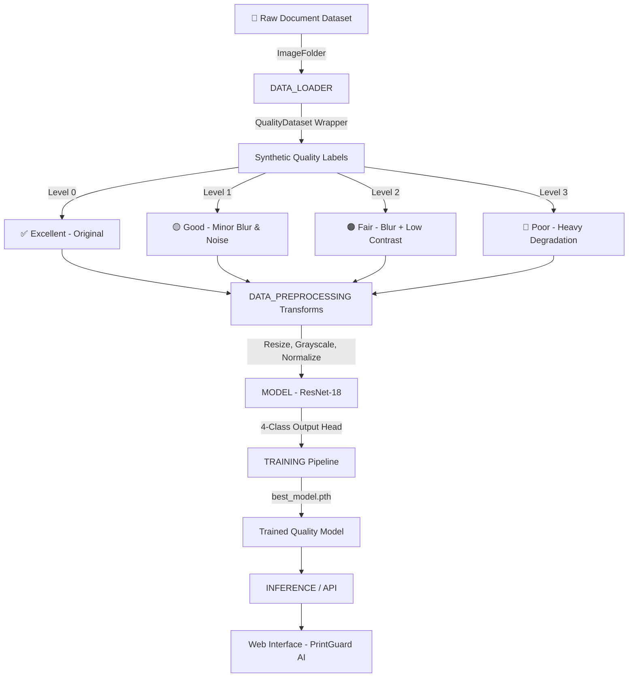
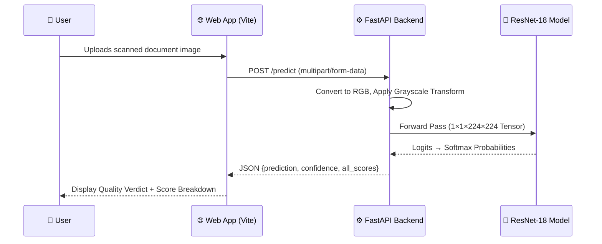
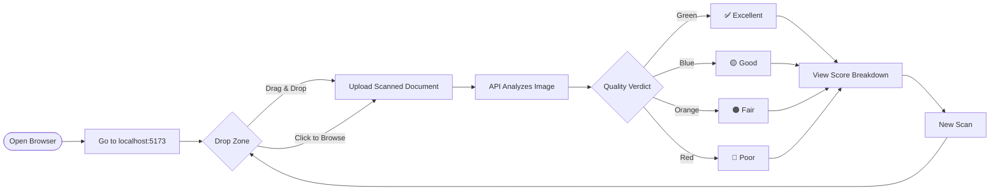

# PrintGuard AI — Industrial Print Quality Detection System

> **Engineered by Ankush Kumar Singh**

An end-to-end, AI-powered **Print Quality Approval System** that uses deep learning to classify scanned document images into four standardised quality grades: **Excellent, Good, Fair, and Poor**.

---

## 🏗️ Project Architecture



---

## 🌊 System Data Flow



---

## 📁 Project Structure

```
core_ml/
│
├── 📂 DATA_LOADER/
│   └── data_loader.py          # QualityDataset wrapper + DataLoaders
│
├── 📂 DATA_PREPROCESSING/
│   ├── preprocessing.py        # Train/Val image transforms
│   └── quality_degradation.py  # Synthetic blur, noise, pixelation pipeline
│
├── 📂 MODEL/
│   └── model.py                # ResNet-18 (grayscale, 4-class output)
│
├── 📂 TRAINING/
│   ├── train.py                # Full training loop with validation
│   └── best_model.pth          # Saved model weights (after training)
│
├── 📂 EVALUATION/
│   └── evaluate.py             # Confusion matrix + Classification report
│
├── 📂 INFERENCE/
│   └── predict.py              # CLI prediction for single images
│
├── 📂 API/
│   └── app.py                  # FastAPI server with /predict endpoint
│
└── 📂 WEB_APP/
    ├── index.html              # PrintGuard AI company website
    ├── style.css               # Dark-mode premium CSS
    ├── main.js                 # API communication + UI logic
    └── package.json            # Vite frontend config
```

---

## 🧠 Quality Grading Framework

| Grade | Level | Description | Use Case |
|---|---|---|---|
| ✅ **Excellent** | 0 | Sharp, high contrast, no noise | Production ready |
| 🟡 **Good** | 1 | Minor blur / slight scan noise | Most commercial print |
| 🟠 **Fair** | 2 | Noticeable artifacts, low contrast | Review recommended |
| 🔴 **Poor** | 3 | Severe degradation, pixelation | Fails quality gate — rescan |

---

## ⚡ How to Use

### Step 1 — Setup

```bash
# Clone the repository
git clone https://github.com/ankushsingh003/Print_Quality_Detection.git
cd Print_Quality_Detection

# Install dependencies
pip install torch torchvision fastapi uvicorn Pillow numpy opencv-python scikit-learn seaborn matplotlib
```

### Step 2 — Prepare Dataset

Place your document images in the `dataset/` folder using the `ImageFolder` format:

```
dataset/
├── CategoryA/
│   ├── img1.jpg
│   └── img2.jpg
└── CategoryB/
    └── img3.jpg
```

> Any category structure works — the system ignores original labels and generates synthetic quality grades automatically.

### Step 3 — Train the Model

```bash
python TRAINING/train.py
```

Speed up training on CPU by reducing dataset size:

```python
# In TRAINING/train.py — adjust these parameters:
train_model(DATA_DIR, num_epochs=2, subset_fraction=0.1)
```

### Step 4 — Run the API Server

```bash
uvicorn API.app:app --host 127.0.0.1 --port 8000 --reload
```

### Step 5 — Run the Web Interface

```bash
cd WEB_APP
npm install
npm run dev -- --host 127.0.0.1 --port 5173
```

Open **[http://127.0.0.1:5173](http://127.0.0.1:5173)** in your browser.

---

## 🖥️ Web Interface Usage



---

## 🔌 API Reference

### `GET /`
Health check endpoint.

**Response:**
```json
{ "message": "PrintGuard AI Quality Detection API is running" }
```

---

### `POST /predict`
Accepts an image file and returns a quality grade.

**Request:** `multipart/form-data` with field `file` (image/*)

**Response:**
```json
{
  "prediction": "Good",
  "confidence": 0.872,
  "all_scores": {
    "Excellent": 0.05,
    "Good": 0.872,
    "Fair": 0.06,
    "Poor": 0.018
  }
}
```

---

## 🔬 Evaluate the Model

```bash
python EVALUATION/evaluate.py
```

Outputs:
- `confusion_matrix.png` — visual class performance grid
- Classification report with Precision, Recall, F1-Score per quality class

---

## 🖼️ Run CLI Prediction

```bash
python INFERENCE/predict.py path/to/your/scan.jpg
```

**Expected Output:**
```
Image: scan.jpg
Predicted Category: Excellent
Confidence Score: 0.9241
```

---

## 🛠️ Tech Stack

| Layer | Technology |
|---|---|
| Deep Learning | PyTorch, torchvision (ResNet-18) |
| Image Processing | Pillow, OpenCV, NumPy |
| API Backend | FastAPI, Uvicorn |
| Frontend | Vite, Vanilla JS, CSS |
| Evaluation | scikit-learn, Matplotlib, Seaborn |

---

## 📄 License

This project is developed for educational and research purposes.

---

*© 2026 PrintGuard AI — Engineered by **Ankush Kumar Singh***
